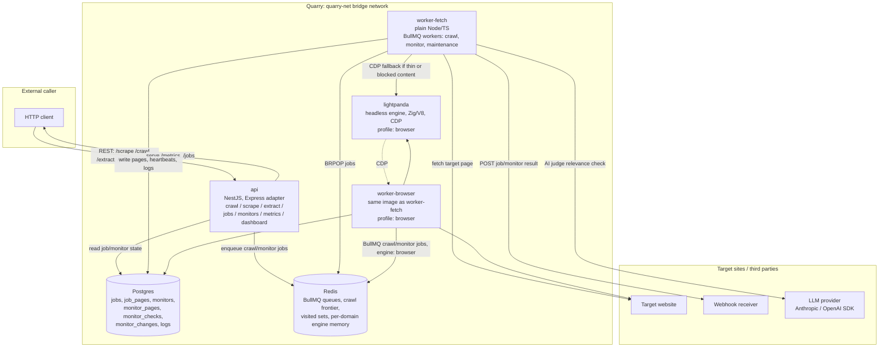
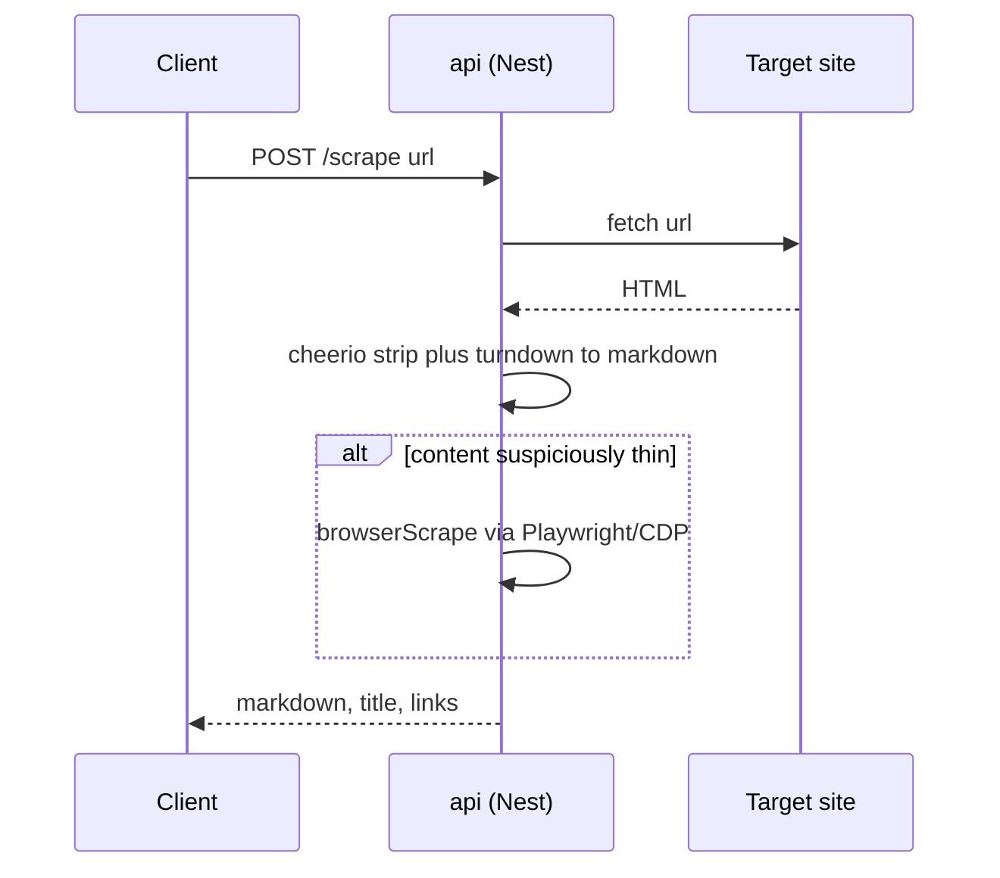
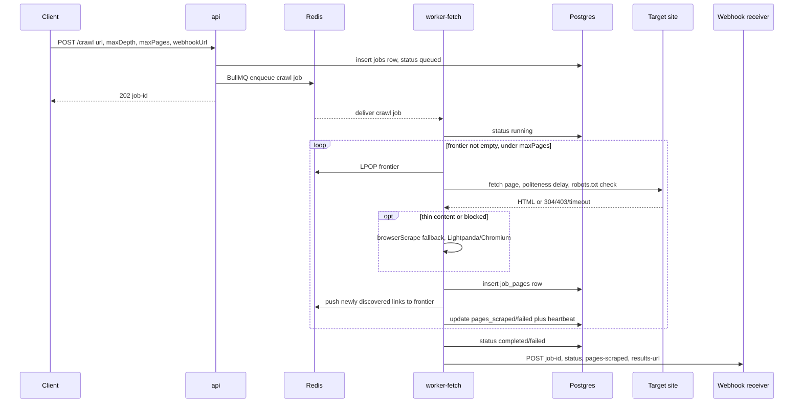
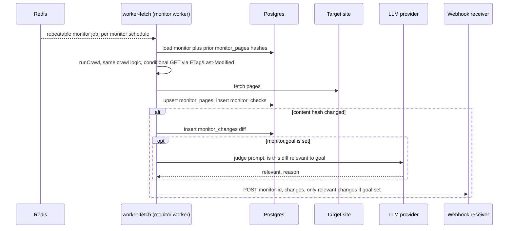
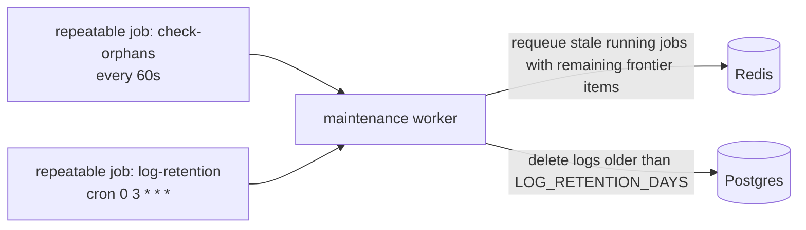

# Quarry — Architecture

This is a descriptive snapshot of how the system fits together today,
derived from the current code (`src/`, `docker-compose.yml`,
`migrations/0001-init.sql`), not a design proposal. See `AGENTS.md` for
the stack decisions behind these choices and `ROADMAP.md` for phase
status.

## Container view

## Request flow: synchronous scrape

## Job flow: async crawl plus webhook

## Monitor flow: scheduled diff plus AI judge

## Maintenance loop

## Notes on what the diagrams simplify

- `lightpanda` and `worker-browser` only exist when the `browser` Docker
  Compose profile is enabled; a fetch-only install never starts them.
- The `crawl` and `monitor` BullMQ queues share the same worker process
  (`fetch.worker.ts`) and the same `runCrawl()` core logic: monitor
  runs are crawls with a `monitorId` attached for diffing, not a
  separate code path.
- `api` and `worker-fetch` are separate containers but share the same
  built image (`dist/`); they differ only in the container `command`.
